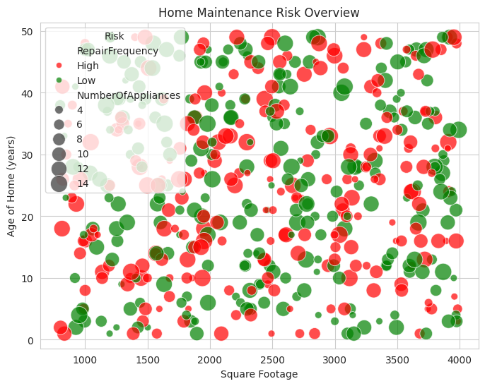
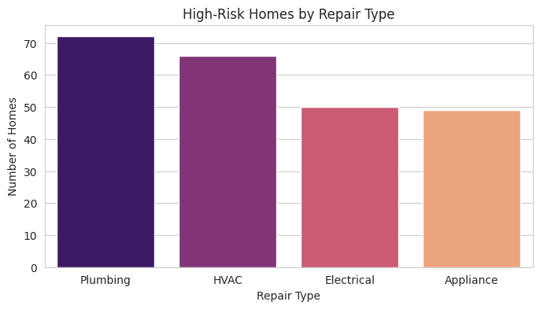

# Predictive Home Maintenance ML Pipeline

## Overview
This project demonstrates a full end-to-end **machine learning workflow** to predict homes at high risk for maintenance or repairs. The goal is to provide actionable insights for proactive home maintenance, simulating real-world applications for home service platforms like Frontdoor and American Home Shield.

Using historical home data (size, age, appliances, repair history, and repair type), the model identifies which homes are likely to require attention soon, helping prioritize maintenance efforts and reduce unexpected breakdowns.

---

## Tech Stack
- **Languages & Libraries:** Python, Pandas, NumPy, scikit-learn, Matplotlib, Seaborn, Joblib  
- **Data Storage & Modeling:** SQL (simulated using SQLAlchemy in Colab)  
- **Deployment / Visualization:** Streamlit (optional dashboard), Colab notebook  

---

## Dataset Features
| Feature | Description |
|---------|-------------|
| HomeID | Unique identifier for each home |
| SquareFootage | Size of the home in square feet |
| AgeOfHome | Age of the home in years |
| NumberOfAppliances | Total number of appliances in the home |
| LastRepairDaysAgo | Days since last repair |
| RepairType | Type of recent repair (Plumbing, HVAC, Electrical, Appliance) |
| RepairFrequency | Target variable – predicted as High or Low maintenance risk |

---

## Methodology
1. **Data Preparation:** Cleaned and preprocessed features, including one-hot encoding for categorical variables.  
2. **Train/Test Split:** Split data into 80% training and 20% testing sets.  
3. **Model Pipeline:** Built a pipeline combining preprocessing and a Random Forest classifier.  
4. **Model Training:** Trained the model on historical home repair data.  
5. **Evaluation:** Tested predictions and generated classification metrics (accuracy, precision, recall).  
6. **Results Visualization:** Created charts to show trends, including:  
   - **High vs Low Maintenance Risk**  
   - **Scatter plot of Square Footage vs Age of Home, sized by Number of Appliances**  
   - **High-Risk Homes by Repair Type**

---

## Results
- The model successfully flags homes at **high risk** for maintenance based on their features.  
- Example high-risk homes from the test dataset:

| HomeID | SquareFootage | AgeOfHome | NumberOfAppliances | LastRepairDaysAgo | RepairType | RepairFrequency |
|--------|---------------|-----------|------------------|-----------------|------------|----------------|
| 1      | 3974          | 48        | 6                | 68              | Plumbing   | High           |
| 6      | 3892          | 16        | 3                | 238             | HVAC       | High           |
| 7      | 2438          | 39        | 14               | 147             | Appliance  | High           |
| 8      | 2969          | 5         | 5                | 226             | Electrical | High           |
| 10     | 2038          | 29        | 11               | 336             | HVAC       | High           |

---

## Visualizations
**1. High vs Low Maintenance Risk**


**2. Scatter Plot – Square Footage vs Age of Home**
- Marker size represents Number of Appliances
- Color indicates predicted risk (High = red, Low = green)  


**3. High-Risk Homes by Repair Type**


---

## How to Run
1. Open the notebook in Google Colab:  
[Open in Colab](https://colab.research.google.com/github/YourUsername/YourRepoName/blob/main/Predictive_Home_Maintenance.ipynb)  
2. Install dependencies (if needed):  
```bash
!pip install pandas scikit-learn sqlalchemy streamlit matplotlib seaborn joblib
